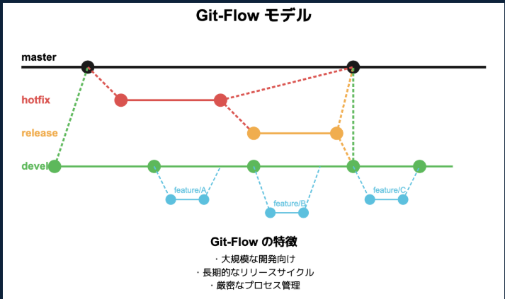

<h2>🌿 ローカルブランチ vs リモートブランチ</h2>

<table>
  <thead>
    <tr>
      <th>項目</th>
      <th>ローカルブランチ</th>
      <th>リモートブランチ</th>
    </tr>
  </thead>
  <tbody>
    <tr>
      <td>📍存在場所</td>
      <td>自分のPC（ローカル環境）</td>
      <td>GitHubなどのリモートリポジトリ</td>
    </tr>
    <tr>
      <td>👤操作できる人</td>
      <td>自分だけ</td>
      <td>チーム全員（push/pull権限による）</td>
    </tr>
    <tr>
      <td>🔄更新方法</td>
      <td><code>git commit</code> で更新</td>
      <td><code>git push</code> / <code>git fetch</code> で同期</td>
    </tr>
    <tr>
      <td>🔍確認コマンド</td>
      <td><code>git branch</code></td>
      <td><code>git branch -r</code></td>
    </tr>
    <tr>
      <td>🔗追跡関係</td>
      <td><code>origin/xxx</code> を追跡することが多い</td>
      <td>ローカルブランチが追跡対象になる</td>
    </tr>
    <tr>
      <td>🛠️作成方法</td>
      <td><code>git checkout -b ブランチ名</code></td>
      <td><code>git push</code> でリモートに作成される</td>
    </tr>
    <tr>
      <td>🧹削除方法</td>
      <td><code>git branch -d ブランチ名</code></td>
      <td><code>git push origin --delete ブランチ名</code></td>
    </tr>
  </tbody>
</table>

<strong>補足:</strong> ローカルブランチは自分の作業用。リモートブランチはチーム共有用。作業完了後は <code>git push</code> でリモートに公開し、他のメンバーが <code>git fetch</code> や <code>git checkout</code> で参加できるようにします。

<h2>🌿 Git ブランチ構成（Git-Flow モデル）</h2>

<table>
  <thead>
    <tr>
      <th>ブランチ名</th>
      <th>役割</th>
      <th>分岐元</th>
      <th>マージ先</th>
      <th>備考</th>
    </tr>
  </thead>
  <tbody>
    <tr>
      <td><code>main</code></td>
      <td>本番リリース履歴</td>
      <td><code>release</code> / <code>hotfix</code></td>
      <td>-</td>
      <td>本番環境にデプロイされた状態を保持</td>
    </tr>
    <tr>
      <td><code>dev</code></td>
      <td>開発統合</td>
      <td><code>main</code></td>
      <td><code>release</code></td>
      <td>ステージング環境と連携</td>
    </tr>
    <tr>
      <td><code>feature/terraform</code></td>
      <td>Terraform構成ドキュメント作成</td>
      <td><code>dev</code></td>
      <td><code>dev</code></td>
      <td>完了後にPRで統合</td>
    </tr>
    <tr>
      <td><code>release/*</code></td>
      <td>リリース準備</td>
      <td><code>dev</code></td>
      <td><code>main</code>, <code>dev</code></td>
      <td>タグ付け・最終調整に使用</td>
    </tr>
    <tr>
      <td><code>hotfix/*</code></td>
      <td>緊急修正</td>
      <td><code>main</code></td>
      <td><code>main</code>, <code>dev</code></td>
      <td>本番障害対応。即時反映</td>
    </tr>
  </tbody>
</table>

<strong>📌 運用ルール:</strong>

<ul>
  <li><code>main</code> は保護ブランチ。直接コミット禁止</li>
  <li><code>dev</code> はステージング環境と連携し、QA/UATに使用</li>
  <li><code>feature/*</code> は機能ごとに分岐し、完了後 <code>dev</code> にマージ</li>
  <li><code>release/*</code> はタグ付け・承認フロー・最終テストに活用</li>
  <li><code>hotfix/*</code> は障害対応テンプレートと連携</li>
</ul>

<h2>🧭 Git-Flow モデル図</h2>

  

<strong>Git-Flow の特徴:</strong>

<ul>
  <li>大規模な開発向け</li>
  <li>長期的なリリースサイクル</li>
  <li>厳密なプロセス管理</li>
</ul>